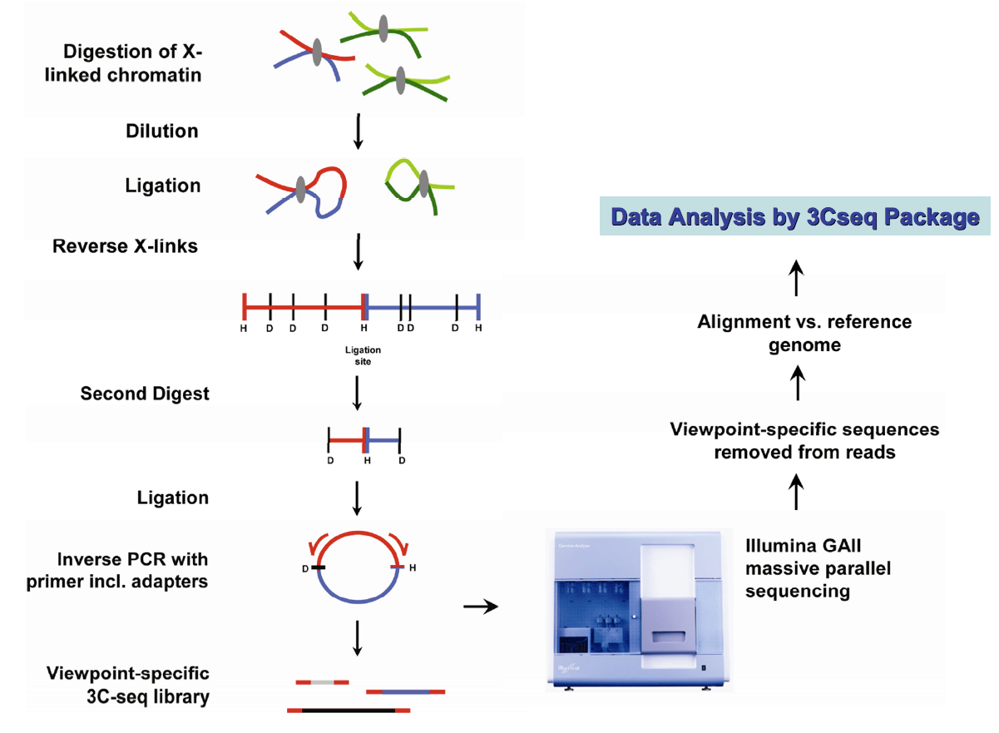

# Abstract

The coupling of chromosome conformation capture (3C)-based and next-generation sequencing (NGS) enable high-throughput detection of long-range genomic interactions via the generation of novel ligation products between DNA sequences that are closely juxtaposed in vivo. These interactions may involve promoter regions, enhancers and other regulatory and structural elements of chromosomes, and can reveal key details in the regulation of gene expression. 3C-seq is a variant of the method for the detection of interactions between one chosen genomic element (viewpoint) and the rest of the genome. We present a R/Bioconductor package designed to perform 3C-seq data analysis in a number of different experimental designs, with or without a control experiment. The package can also be used to perform data analysis for the experiment with replicates. The package provides functions to perform 3C-seq data normalization, statistical analysis for cis/trans interactions and visualization to facilitate the identification of genomic regions that physically interact with the given viewpoints of interest. The r3Cseq package greatly facilitates hypothesis generation and the interpretation of experimental results.

# Introduction

This vignette describes how to use the r3Cseq package. r3Cseq [@Supat:2013] is a Bioconductor-compliant R package designed to facilitate the identification of interaction regions generated by chromosome conformation capture and next-generation sequencing (3C-seq). The fundamental principles of 3C-seq briefly described in the following [@Soler:2010] , isolated cells are treated with a cross-linking agent to preserve in vivo nuclear proximity between DNA sequences. The DNA isolated from these cells is then digested using a primary restriction enzyme, typically a 6-base pairs cutting enzyme such as HindIII, EcoRI or BamHI. The digested product is then ligated  under dilute conditions to favor intra-molecular over inter-molecular ligation events. This digested and ligated chromatin yields composite sequences representing (distal) genomic regions that are in close physical proximity in the cell nucleus. The digested and ligated chromatin is then de-crosslinked and subjected to a second restriction digest using either Nla III or Dpn II (a 4-cutter) as a secondary restriction enzyme to decrease the fragment sizes. The digested DNA is then ligated again under diluted conditions, creating small circular fragments. These fragments are inverse PCR-amplified using primers specific for a genomic region of interest (eg. promoter, enhancer, or any other element potentially involved in long-range interactions), termed the "viewpoint".
The amplified fragments are then sequenced using massively parallel high-throughput sequencing. Because the 3C-seq procedure hybrid DNA molecules being a combination of viewpoint-specific  primers
followed by sequences dervied from the ligated interaction fragments. As such, these composite sequences are unmappable and need to be trimmed to removed the viewpoint sequences, thus leaving only the capture sequence fragments for mapping. After trimming, reads are mapped against a reference genome using alignment software such as Bowtie. A mapped read file generated by the mapping software is then transformed to the BAM file and analyzed using the r3Cseq package.


# Preparation input files
The required input is the BAM file, obtained as an output from the mapping software. 
The BAM file name must not contain any special symbols such as '*', '%', '$', '#', '!', '@', and "-". 
The "-" and "." must be replaced by using "_". The file name must be short and simple. 
For example, the original file name "%RIKO-R1-T5_S15_L001.trimmed_experiment.sorted.bam" must be changed to "RIKO_R1_T5_S15_L001.bam".

The represented identifier for a reference genome shown in each input BAM file is important to properly run r3Cseq. The represented identifier for each chromosome must be in "chr[1..19XYM]" format for the mouse reference genome and "chr[1..22XYM]" format for the 
human reference genome. Therefore, before using the package, a user has to check the identifier for the reference genome. If the identifier for each chromosome found in the mapped file
is not in a proper format for example 'mm9\_ref\_chr01.fa', the Unix command like 'sed' might
be used to replace 'mm9\_ref\_chr01.fa' to 'chr1'.

# Getting started
3C-seq data  generated by [@Ralph:2012] will be used for the demonstration. 
The current version of r3Cseq supports mouse, human, and rat genomes. 
Therefore, the package requires one of the followings  [_BSgenome_](https://bioconductor.org/packages/release/bioc/html/BSgenome.html) 
packages to be installed; [_BSgenome.Mmusculus.UCSC.mm9.masked_](http://bioconductor.org/packages/release/data/annotation/html/BSgenome.Mmusculus.UCSC.mm9.masked.html),
[_BSgenome.Mmusculus.UCSC.mm10.masked_](http://bioconductor.org/packages/release/data/annotation/html/BSgenome.Mmusculus.UCSC.mm10.masked.html),
[_BSgenome.Hsapiens.UCSC.hg18.masked_](http://bioconductor.org/packages/release/data/annotation/html/BSgenome.Hsapiens.UCSC.hg18.masked.html),[_BSgenome.Hsapiens.UCSC.hg19.masked_](http://bioconductor.org/packages/release/data/annotation/html/BSgenome.Hsapiens.UCSC.hg19.masked.html), and
[_BSgenome.Rnorvegicus.UCSC.rn5.masked_](http://bioconductor.org/packages/release/data/annotation/html/BSgenome.Rnorvegicus.UCSC.rn5.masked.html).

Loading the r3Cseq package into R.

```{r load_r3Cseq, message=FALSE, warning=FALSE}
library(r3Cseq)
```
There are 2 example data sets found in the package.
```{r load_data, message=FALSE, warning=FALSE}
data(Myb_prom_FL)
data(Myb_prom_FB)
```
_Myb_prom_FL_, the 3C-seq data contains the aligned reads of
the Myb promoter interactions signal in fetal liver. 
It was stored in the 'GRanges' object processed by the 'Rsamtools' package.

_Myb_prom_FB_, the 3C-seq data contains the aligned reads of Myb promoter interactions signal in fetal brain.

We will next perform r3Cseq to discover interaction regions, which possibly interact with the promoter region of Myb gene in both fetal liver and brain [@Ralph:2012].

# r3Cseq object initialization
In this section, we will analyze 3C-seq data, which were derived from fetal liver (high levels of the Myb gene expression) and fetal brain (expressing low level of the Myb gene). The latter will be used as a negative control. More examples of r3Cseq data analysis can be found on the r3Cseq 
website [_http://r3cseq.genereg.net_](http://r3cseq.genereg.net). We firstly initialize the r3Cseq object.

```{r initialization, message=FALSE, warning=FALSE}
my3Cseq.obj<-new("r3Cseq",organismName='mm9',isControlInvolved=TRUE,
viewpoint_chromosome='chr10',viewpoint_primer_forward='TCTTTGTTTGATGGCATCTGTT',
viewpoint_primer_reverse='AAAGGGGAGGAGAAGGAGGT',expLabel="Myb_prom_FL",
contrLabel="MYb_prom_FB",restrictionEnzyme='HindIII')
```
The description of input parameters is described in the r3Cseq help page.
We next add raw reads from "Myb_prom_FL" and "Myb_prom_FB" to the existing _my3Cseq.obj_.

```{r add_data, message=FALSE, warning=FALSE}
expRawData(my3Cseq.obj)<-exp.GRanges
contrRawData(my3Cseq.obj)<-contr.GRanges
my3Cseq.obj
```

# Getting reads per restriction fragments/user defined window size
To get number of reads per restriction fragment, function getReadCountPerRestrictionFragment will be performed.

```{r get_read_per_fragment, message=FALSE, warning=FALSE}
getReadCountPerRestrictionFragment(my3Cseq.obj)
```
The package also provides the function _getReadCountPerWindow_ to count number of reads
per non-overlapping window size defined by a user.

# 3C-seq data normalization
We next perform data normalization.
```{r normalization, message=FALSE, warning=FALSE}
calculateRPM(my3Cseq.obj)	
```
# Getting interaction regions
After normalization, the _getInteractions_ function will be performed.
```{r getInteractions, message=FALSE, warning=FALSE}
getInteractions(my3Cseq.obj,fdr=0.05)	
```
To see the result of interaction regions, Two functions _expInteractionRegions_ and _contrInteractionRegions_ can be used to access the slot of r3Cseq object.
To get the result of interaction regions for the experiment, _expInteractionRegions_ will be performed.

```{r getExp_Interactions, message=FALSE, warning=FALSE}
fetal.liver.interactions<-expInteractionRegions(my3Cseq.obj)
fetal.liver.interactions
```
To get the result of interaction regions for the control, _contrInteractionRegions_ will be performed.

```{r getContr_Interactions, message=FALSE, warning=FALSE}
fetal.brain.interactions<-contrInteractionRegions(my3Cseq.obj)
fetal.brain.interactions
```
# Getting the viewpoint information
To see the viewpoint information,  _getViewpoint_ function can be used. 
_getViewpoint_ will return the _GRanges_ object of the viewpoint information.

```{r getViewpoint, message=FALSE, warning=FALSE}
viewpoint<-getViewpoint(my3Cseq.obj)
viewpoint
```
# Visualization of 3C-seq data
r3Cseq package provides visualization functions.
These functions are _plotOverviewInteractions_, _plotInteractionsNearViewpoint_,
_plotInteractionsPerChromosome_, and _PlotDomainogramNearViewpoint_.

_plotOverviewInteractions_ function shows the overview of interaction regions distributed across genome.

```{r plotOverviewInteractions, fig.width=9, fig.height=8}
plotOverviewInteractions(my3Cseq.obj)	
```
_plotInteractionsNearViewpoint_ function shows the zoom in of interaction regions located close to the viewpoint.

```{r plotInteractionsNearViewpoint,fig.width=9, fig.height=8}
plotInteractionsNearViewpoint(my3Cseq.obj)
```

_plotInteractionsPerChromosome_ function shows the interaction regions found in the chromosome10.

```{r plotInteractionsPerChromosome, fig.width=9, fig.height=8}
plotInteractionsPerChromosome(my3Cseq.obj,"chr10")
```

_plotDomainogramNearViewpoint_ function shows the domainogram of interactions found in _cis_. 
This function may takes minutes to produce the domainogram plot.

```{r plotDomainogramNearViewpoint, fig.width=9, fig.height=8}
plotDomainogramNearViewpoint(my3Cseq.obj,view="both")
```

# Associate interaction signals to the Refseq genes
_getExpInteractionsInRefseq_ and _getContrInteractionsInRefseq_ functions can be used to detect the list of genes that contain significant interaction signals in their proximity.

```{r detected_genes, message=FALSE, warning=FALSE}
detected_genes<-getExpInteractionsInRefseq(my3Cseq.obj)
head(detected_genes)
```

# Export interactions to the bedGraph format
_export3Cseq2bedGraph_ function exports all interactions from the GRanges object to the bedGraph format, which can be uploaded to the UCSC genome browser.

```{r export3Cseq, message=FALSE, warning=FALSE}
export3Cseq2bedGraph(my3Cseq.obj)	
```
# Summary report
_generate3CseqReport_ function generates the summary report
from r3Cseq analysis results. The report contains
a pdf file for all plots and text files of interaction regions.
This function may takes minutes to produce the report. 

```{r generate3CseqReport, message=FALSE, warning=FALSE}
generate3CseqReport(my3Cseq.obj)	
```
# Working with replicates
The example of how to work with replicats is shown on
[_http://r3cseq.genereg.net/_](http://r3cseq.genereg.net/) website.

[_http://r3cseq.genereg.net/_](http://r3cseq.genereg.net) provides more details of r3Cseq analysis pipeline. 
The example data sets can be downloaded from the website. 

# Session info
Here is the output of sessionInfo on the system on which this document was
compiled:

```{r sessionInfo, echo=FALSE}
sessionInfo()
```
# References
